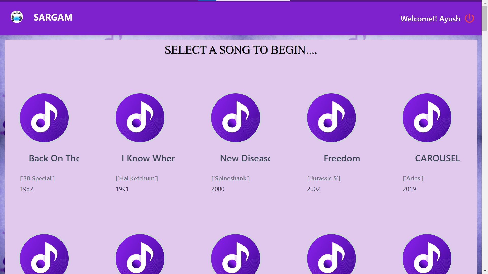

<!-- PROJECT LOGO -->
<br />
<p align="center">
  <a href="https://github.com/radiaoctive11/rezonance">
    
  </a>
  <h1 align="center">SARGAM</h1>
  <p align="center">
    Content Based Music Recommendation Service
  </p>
</p>

#

# Music-Recommendation-Engine
A **Recommendation engine** is a filtering system which aims to predict  preference a user would give to an item, eg. a film, a product, a song, etc.

There are two main types of recommender systems:

- **Content-based filters**: gives recommendations based on the similarity of two songs.[Medium post](https://medium.com/@meinzaugarat/the-abc-of-building-a-music-recommender-system-part-i-230e99da9cad)
- **Collaborative filters**: make a prediction on posible preferences using a matrix with ratings on songs by different users.[Medium post](https://medium.com/@meinzaugarat/the-abc-of-building-a-music-recommender-system-part-ii-65ec3900d19f)

## Problem Statement

This project is made under **Microsoft Intern Engage 2022** program.
The problem statement given was:
>Demonstrate through your app the different kinds of algorithms that a web-streaming app (like Netflix) or an audio-streaming app (like Spotify) may use for their Recommendation Engine.

## About the Project
The recommendation Engine made is a Content-based filtering system which predits the next user's choice on the basis of Genre and the year of release of the song being played. The engine uses [K-means Clustering](https://blogs.oracle.com/ai-and-datascience/post/introduction-to-k-means-clustering#:~:text=K%2Dmeans%20clustering%20is%20a,represented%20by%20the%20variable%20K.) to predict the songs.

## Built With
<p float = "left">


  

  

  


</p>

## Installing Packages
- Run the following codes on requirement.txt to install all required packages
```sh
pip3 install -r requirements.txt
```

## Running the Project
- Clone the repository to your local system
- Run the following commands one by one
```sh
python manage.py makemigrations
python manage.py migrate
python manage.py runserver
``` 
- Go to the localhost server link provided to go to the website

## Dataset
Dataset used in this recommendation system is provided in the repo. The dataset was downloaded from internet and tweaked a bit for the efficiency of the program.

## Navigating Through the Website
1. **Login**: The first page that user interacts with is the Login page. The user needs to Login first to start using the application. If the User  is not registered then he/she can go to the Registeration page to register first. If the user enters wrong credentials than also the user will be transfered to Registration page.


2. **Registration**: The Registration page takes Name, Email Id, Username and Password as input and redirects to the Login page to continue.


3. **Welcome**: After the user is logged in he will be redirected to the Welcome page where 100 random songs will be displayed and user can choose from any song to continue with. Then the recommendations will be based on the songs that the user chooses.



4. **Index**: After the user chooses a song on the Welcome page he will be directed to the Index page where the user gets recommendations on the basis of the songs he/she clicks on. The user can play a song available in meantime he surfs the website.


5. **Logout**: The user is also provided an option to Logout when and where the user wishes to. After logging out the user will be directed to the login page.


